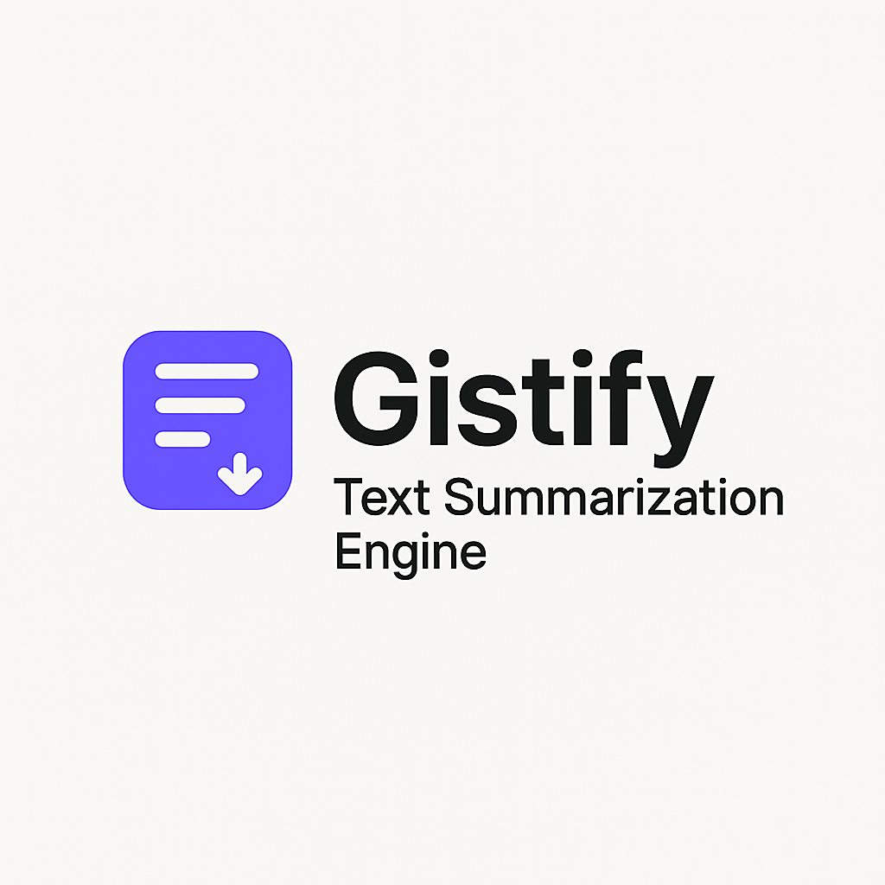
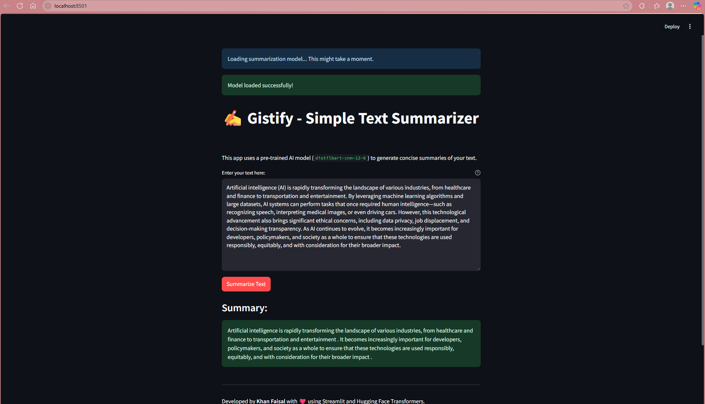
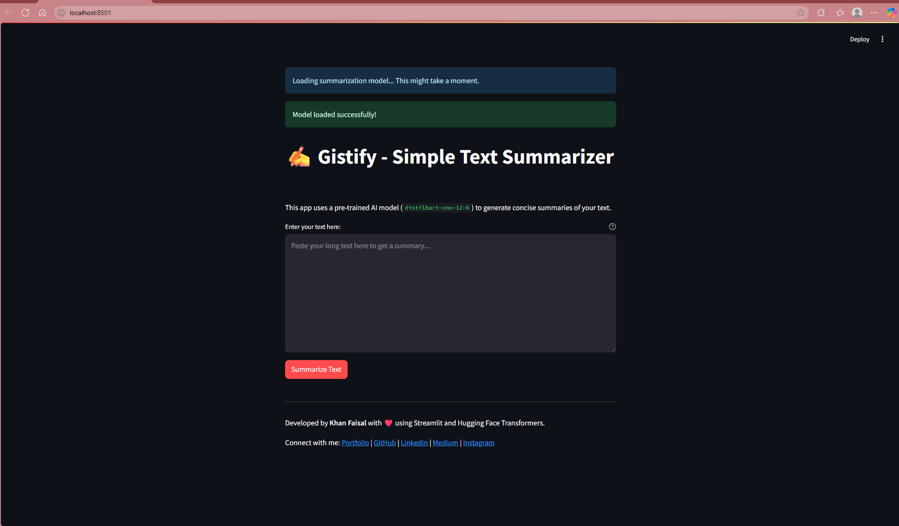

# Gistify - Simple Text Summarizer



## 🧠 Project Overview

**Gistify** is a user-friendly web application built with **Streamlit** that allows you to quickly generate concise summaries of long texts. It leverages a powerful pre-trained deep learning model from the **Hugging Face Transformers** library to extract the most important information from your input, providing you with a *gist* of the content.

---

## ✨ Features

- **Intuitive User Interface**: Clean and simple design for easy text input and summarization.
- **AI-Powered Summarization**: Utilizes the `sshleifer/distilbart-cnn-12-6` model, a distilled version of BART, known for its efficiency and effectiveness in summarization tasks.
- **Real-time Processing**: Provides a quick summary once you hit the "Summarize Text" button.
- **Responsive Design**: Works well across different screen sizes.

---

## 🛠 Technologies Used

- Python 3.x
- Streamlit – for building interactive web applications
- Hugging Face Transformers – for utilizing pre-trained NLP models
- PyTorch – as the underlying deep learning framework

---

## ⚙️ Setup Instructions

Follow these steps to get **Gistify** up and running on your local machine.

### ✅ Prerequisites

- Python 3.8+ (recommended)

```bash

git clone https://github.com/khanfaisal79960/Gistify.git
cd Gistify
python -m venv venv
source venv/bin/activate  # or .\venv\Scripts\activate on Windows
pip install -r requirements.txt
streamlit run app.py

```

Open your browser at: [http://127.0.0.1:5000](http://127.0.0.1:5000)

---

| Home Page | Recommendations |
|-----------|-----------------|
|  |  |

---

## 🚀 Usage

1. **Enter Text**: Paste or type your text into the "Enter your text here:" area.
2. **Summarize**: Click the "Summarize Text" button.
3. **View Summary**: Your summarized text will appear below.

---

## 🤝 Contributing

Feel free to fork this repository, open issues, or submit pull requests. Contributions are welcome!

---

### 🔗 Connect with Me


**Faisal Khan**  
- 🌐 [Portfolio](https://khanfaisal.netlify.app)  
- 💼 [LinkedIn](https://www.linkedin.com/in/khanfaisal79960)  
- ✍️ [Medium](https://medium.com/@khanfaisal79960)  
- 📸 [Instagram](https://instagram.com/mr._perfect_1004)  
- 💻 [GitHub](https://github.com/khanfaisal79960)  

---

